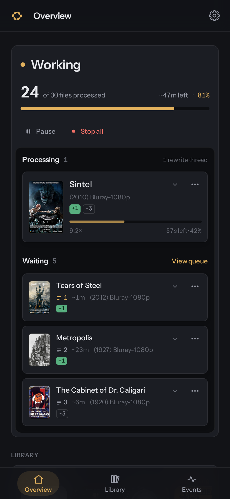
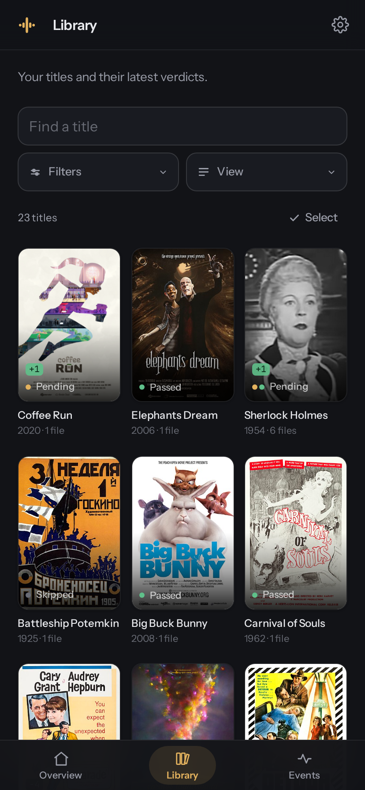
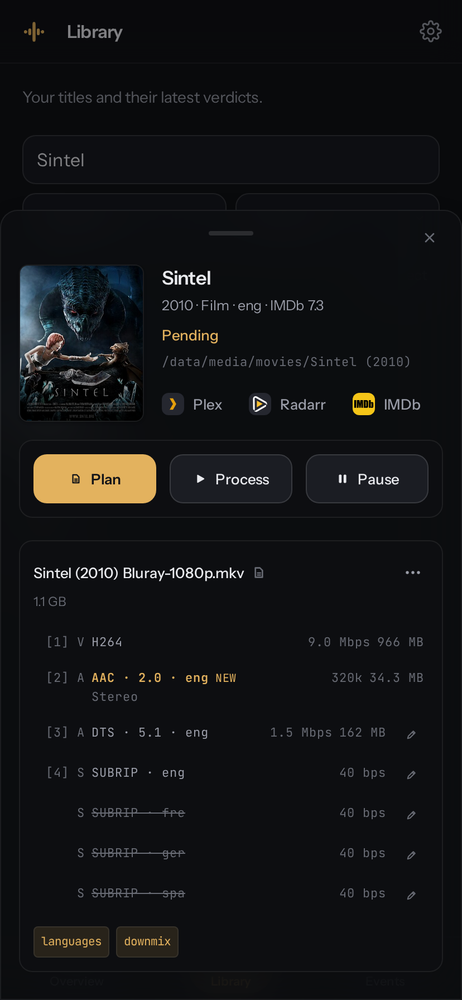

# Trackstarr

[](https://github.com/MarcedForLife/trackstarr/actions/workflows/ci.yml)
[](LICENSE)
[](https://github.com/MarcedForLife/trackstarr/pkgs/container/trackstarr)

Trackstarr tidies your movie and TV library. It works with Radarr and Sonarr to remove unwanted
tracks, add missing audio downmixes and put everything in your preferred order. It also includes a
range of optional cleanup rules.

### [Try the live demo](https://marcedforlife.github.io/trackstarr/)

Explore a sample library in your browser without any setup. If prompted, sign in with any username
and password. Reload to reset it.

<p align="center">
  <a href="https://marcedforlife.github.io/trackstarr/">
    
    
    
  </a>
</p>

<p align="center">
  <a href="#quick-start">Quick start</a> ·
  <a href="docs/rules.md">Rules</a> ·
  <a href="docs/configuration.md">Configuration</a> ·
  <a href="docs/screenshots/README.md">Screenshot credits</a>
</p>

## What it does

- Keep original-language audio and selected dubs, add stereo or surround mixes, choose codecs and
  bitrates, and remove unwanted layouts.
- Remove commentary, redundant SDH subtitles, embedded artwork and release tags. Convert MP4/M4V to
  MKV, or remove Dolby Vision while preserving the HDR10 base layer and existing HDR10+ metadata.
- Process new imports or schedule library sweeps. Preview changes, pause processing or individual
  titles and files, and defer hard-linked files.
- Search and filter the library, edit MKV track tags and review history in the web UI. Admins manage
  processing and settings, viewers have read-only access.
- Refresh Plex, Jellyfin or Emby after a rewrite.

## Quick start

```yaml
services:
  trackstarr:
    image: ghcr.io/marcedforlife/trackstarr:latest
    container_name: trackstarr
    restart: unless-stopped
    user: '${PUID:-1000}:${PGID:-1000}'
    ports:
      - '5120:5120'
    volumes:
      - /srv/media:/data
      - /srv/config/trackstarr:/config
    environment:
      MEDIA_DIRS: /data/movies:/data/tv
      TZ: Pacific/Auckland
```

1. Create `/srv/config/trackstarr` owned by the container user, for example
   `sudo install -d -o 1000 -g 1000 /srv/config/trackstarr`. The user also needs write access to the
   media and staging directory (`/data/trackstarr-work` by default).
2. Save the example as `compose.yaml`, adjust the paths and timezone, and run
   `docker compose up -d`.
3. Open port 5120 in your browser. Sign in as `admin` with the password from the container log, then
   change it when prompted.
4. Add Radarr and Sonarr under **Settings / Connections**. Trackstarr registers their webhooks
   automatically.

Mount media at the same paths as Radarr and Sonarr, and include those roots in `MEDIA_DIRS`. Set
`WEBHOOK_URL` if they cannot reach `http://trackstarr:5120`. Use **Test** on each connection to
check its API, webhook callback and visible library roots.

`REWRITE_MODE=imports` is the default. It rewrites new imports and reports changes for library
sweeps. Use `report` to preview all changes or `all` to rewrite during sweeps too. Review
`/config/pending.tsv` before enabling `all`.

## Rules

Set rules in **Settings** or environment variables. Each `RULE_<NAME>` accepts `always`, `alongside`
(only during another required rewrite), or `never`.

Defaults keep original-language and English audio and subtitles, create missing stereo AAC and 5.1
AC3 mixes from larger sources, remove embedded artwork and order tracks. Untagged tracks stay.
Trackstarr never upmixes or removes every audio track.

This keeps French without downmixing it, uses Opus for stereo and retains 7.1 tracks.

```yaml
LANGUAGES: original,eng,fre:keep
AUDIO_LAYOUTS: 2.0:libopus:192k,5.1:ac3:640k,7.1:keep
```

Original-language tagging and regeneration of existing mixes are opt-in. See
[rules and audio](docs/rules.md) for defaults, layout syntax and conditions.

## Processing and safety

Webhooks queue imports and update verdicts when Radarr or Sonarr reports replaced, deleted or
renamed files. `SWEEP_AT` schedules sweeps of `MEDIA_DIRS` using cron in the configured timezone.
Results go to `/config/pending.tsv`. Imports run before queued sweep work unless you reorder the
queue. Active rewrites finish first.

`SKIP_HARDLINKS=true` defers files with hard links until the links are removed. `HARDLINK_RECHECK`
sets the retry interval in seconds, 900 by default. Titles can also be paused for a set time or
indefinitely. Paused files are still planned but not processed.

Rewrites are staged in `WORK_DIR`, which needs space for the output. Trackstarr checks duration and
stream count before replacing the original, and defers files that change during processing. Track
removal is permanent.

If a configured Radarr or Sonarr library cannot be listed and the policy uses `original`, applying
sweeps fall back to report-only to protect original-language audio.

Configure Plex or Jellyfin (also used for Emby) to refresh rewritten files. Map differing paths with
a setting such as `PLEX_PATH_MAP=/data/media=/srv/media`.

## Commands

```sh
trackstarr serve              # web UI, API, webhooks and scheduled sweeps
trackstarr sweep              # report library changes in /config/pending.tsv
trackstarr sweep --apply      # apply library changes, unless mode is report
trackstarr fix FILE...        # plan and rewrite selected files
trackstarr plan FILE...       # explain changes and print the ffmpeg command
trackstarr secret NAME        # create a caller's webhook secret
trackstarr user add NAME      # create an account (--role admin|viewer)
trackstarr user passwd NAME   # reset a password and invalidate sessions
trackstarr user rm NAME       # delete an account (except the last admin)
trackstarr user list          # list accounts and roles
```

Use `--original LANG` with `plan` or `fix` for files outside a Radarr or Sonarr library.

```sh
trackstarr plan --original eng "Tears of Steel (2012).mkv"
```

`REWRITE_MODE=report` prevents rewrites even with `fix` or `sweep --apply`. Title pauses also apply.

## Configuration

Non-empty environment variables override saved UI settings. See the
[configuration reference](docs/configuration.md) for all settings,
[multiple arr instances](docs/configuration.md#multiple-arr-instances-and-variants),
[credentials](docs/configuration.md#credentials), and
[accounts and reverse proxies](docs/configuration.md#accounts-and-reverse-proxies).

## Development

Use Python 3.14+, uv, Node.js/npm (CI uses Node 26), ffmpeg/ffprobe 8.1+ and mkvtoolnix.

```sh
uv sync --locked
cp .env.example .env          # local state and staging under dev/
uv run dev.py                # starts API and UI with hot reload
uv run pytest
uv run pytest --cov          # enforces 100% coverage
uv run ruff check
uv run ruff format --check
uv run mypy
```

`dev.py` installs missing web dependencies. Integration tests need ffmpeg and tag-editing tests need
`mkvpropedit`. Commit `uv.lock` after dependency changes.

See [web development](web/README.md) for frontend setup and checks.

## Licence

MIT. Trackstarr is independent of Radarr, Sonarr, Plex, Jellyfin, Emby and IMDb.

The container image ships ffmpeg (GPL) and [MKVToolNix](https://mkvtoolnix.download) (GPL), run as
separate programs. Service logos come from
[Dashboard Icons](https://github.com/homarr-labs/dashboard-icons) (Apache 2.0) and
[Simple Icons](https://simpleicons.org) (CC0). Each mark stays its owner's trademark.
