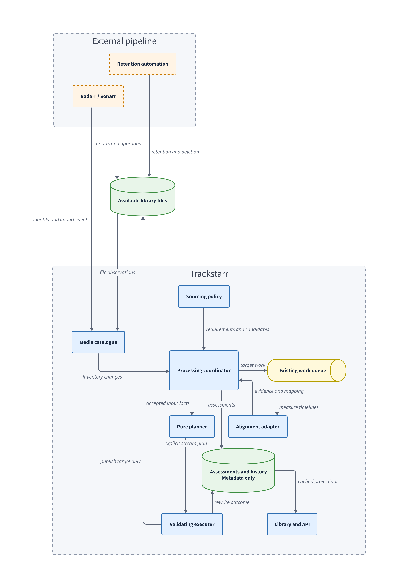

# Audio sourcing between variants

Proposed design for [issue #7](https://github.com/MarcedForLife/trackstarr/issues/7).
Reviewed against repository revision `69fbc85`. This is an implementation plan, not
a description of shipped behaviour. The responsibility boundary is agreed. The
configuration names, contracts and release scope below are proposals.

## Purpose and boundary

Trackstarr currently processes each variant independently. A preferred video
release may lack a requested dub even when another connected library contains it.
This feature adds audio from those available variants and aligns it to the target.

Source and target are roles within one copy operation. A variant can supply a
French track to another variant and receive an English track from it. Connections
and files have no permanent source or target classification.

Trackstarr owns matching, track selection, alignment, planning and validated
publication. The surrounding pipeline owns acquisition, upgrades, source retention
and deletion. Trackstarr does not request downloads, manage arr instances or retain
audio or visual samples for future upgrades. An upgraded target with no source
remains visibly incomplete until another source becomes available.

Temporary analysis samples and prepared audio live only in a job workspace and
are removed on completion, cancellation or orphan recovery. Persisted state
contains metadata, alignment measurements and processing history only. Deleting
that state never deletes library media.

Reaching an arr upgrade ceiling may inform an external source retention policy.
Trackstarr neither interprets that ceiling nor declares a source safe to delete.
A successful copy reports what happened to one target revision.

## Initial release

The first usable release includes automatic discovery of missing audio languages,
measured alignment, manual source selection and timing adjustment, and reassessment
after imports or replacements. Constant offsets and constant speed differences
are required. Automatic repair of different cuts or discontinuous timelines is
deferred unless the evaluation demonstrates reliable support within the same
contracts. Such files must produce a review outcome, not a speculative copy.

Automatic sourcing adds one suitable main audio source per missing language.
Existing layout rules may retain it or derive the requested downmixes. It does not
upgrade an already present dub based on codec, bitrate or channel count. Subtitle
sourcing, cross-title copying, assembling several episode files and persistent
manual overrides across future releases are outside this release.

MKV is the initial sourcing output. An MP4/M4V target requires the existing remux
rule to permit conversion. Sources may use any container the selected tools can
read. The target's video, chapters, attachments and existing tracks remain subject
to its ordinary rules. Sourcing itself never substitutes source video or chapters.

## Existing foundations and gaps

| Area | Current implementation | Required change |
| --- | --- | --- |
| Library | Titles merge by provider identity. Episode variants are grouped by filename for display. | Authoritative file and episode identities for processing. |
| Planning | `Plan` and `OutStream` describe one input. Rules are pure after probing. | Explicit input references and an independent sourcing assessment. |
| Execution | One FFmpeg input, staged validation and replacement. | Several inputs, timing transforms and dependency validation. |
| Cache | A verdict depends on target stat information and policy. | Also account for source inventory and alignment dependencies. |
| Scheduling | Discovery and work share an ordered queue. Imports deduplicate by path. | Analysis handoff, affected-target admission and revisions arriving during active work. |
| Concurrency | Scheduler and observation fences coordinate one process. Flock slots limit rewrites across processes. | Shared source leases and exclusive target leases across all mutation paths. |
| Status | No required rewrite can be reported as conforming. | Requested-track completeness independent of rewrite outcome. |

Starting points are [the planner](../src/trackstarr/planner.py),
[processing orchestration](../src/trackstarr/processing.py),
[library projection](../src/trackstarr/library.py) and
[the shared scheduler](../src/trackstarr/work.py).

## Architecture

The implementation keeps decision logic pure and puts filesystem, arr and process
operations at explicit boundaries. Immutable dataclasses carry observations and
decisions between components. A small `Protocol` defines the alignment adapter.
There is one production adapter initially, with no plugin registry or engine
inheritance hierarchy.

| Component | Responsibility | Must not own |
| --- | --- | --- |
| Media catalogue | Resolve content identity and produce immutable file inventories. | UI rendering, rule decisions or rewriting. |
| Sourcing policy | Determine missing languages, eligible candidates and deterministic preference. | Probing, subprocesses or scheduling. |
| Alignment adapter | Measure relationships between two file timelines and report evidence. | Track rules or publication. |
| Processing coordinator | Collect facts, schedule analysis and compose a complete plan. | Tool-specific matching algorithms. |
| Planner | Turn target streams and accepted source tracks into output operations. | Library discovery or external API calls. |
| Executor | Prepare audio, render, validate and publish one target. | Source selection or acquisition. |
| Library/API projection | Present cached assessments, plans and history. | Expensive analysis during a GET request. |

Proposed modules are `catalogue.py`, `sourcing.py`, `alignment.py`,
`sourcing_store.py` and `file_leases.py`, alongside extensions to the existing
planner, command renderer and coordinator. The backend adapter belongs beside
`alignment.py` when it contains enough implementation to justify a separate file.
Extract catalogue identity code from library presentation rather than importing
`library.py` into the planner. Existing local-only calls retain their behaviour.

## Configuration and policy

Each arr connection gains an ordered `AUDIO_SOURCES` list of connections whose
variants may supply missing tracks. Entries must have the same arr type. The list
may include the connection itself when it contains several matching variants.
Reciprocal lists are valid. UI connection order does not choose a target or imply
copy permission. Every writable variant with sourcing enabled is evaluated as a
target independently.

An independent `PROCESS_MEDIA` setting defaults to true and controls mutation of
that connection's files. False permits indexing, probing and use as a source, but
prevents rewrites and retagging through every entry point. This supports libraries
mounted read-only without assigning them a special sourcing role. A permission
change is checked again at execution and publication.

| Setting | Default | Meaning |
| --- | --- | --- |
| `RULE_SOURCE_AUDIO` | `never` | Existing `never`, `alongside`, `always` rule semantics. |
| `SOURCE_AUDIO_LANGUAGES` | Empty | Languages explicitly required through sourcing. Supports `original`. |
| `<ARR>_PROCESS_MEDIA` | `true` | Whether Trackstarr may modify this connection's files. |
| `<ARR>_AUDIO_SOURCES` | Empty | Ordered source connection IDs for this target connection. |

`<ARR>` follows existing instance names, for example `RADARR_4K`.
Settings use the existing file, environment override and vocabulary mechanisms.
Sourced languages must be included in the target's retained languages after
resolution. Statically conflicting settings are rejected when saved. At assessment
time, a candidate is rejected if layout policy would leave no retained output in
the requested language.
An unresolved `original` produces an explicit unknown requirement.

Enabling sourcing does not turn every existing `LANGUAGES` entry into a requirement.
With `never`, there is no automatic sourcing obligation. Manual copying remains
available subject to target rules and execution permissions. With `alongside`,
missing languages are reported, but analysis and copying occur automatically only
when an independent rule already requires a rewrite. Imported tracks and their
derived downmixes cannot bootstrap an `alongside` rewrite.

## Identity and inventory

`ContentKey` is independent of paths and connection-local IDs. A movie uses a
namespaced TMDB identity. An episode uses a namespaced TVDB series identity and
authoritative episode identity or a consistent numbering mapping from Sonarr.
Numeric provider IDs always carry the provider and media kind.

Arr file endpoints supply file ownership and episode membership. Connection-local
movie, series and episode IDs remain API locators only. Where episode identities
cannot be reconciled confidently across instances, automatic sourcing waits for
review. Filename matching remains a presentation fallback, not write authority.
Multi-episode files are initially excluded from automatic sourcing. Known edition
conflicts are rejected before analysis. Shared title identity alone does not prove
matching cuts.

An inventory records files, owning connections, content keys, probe summaries and
availability. Missing files differ from an unavailable mount or failed arr listing.
An unavailable source instance never produces a claim that the language does not
exist. Another readable, eligible source may still satisfy the requirement.

Shared roots with ambiguous ownership, target/source path aliases and files sharing
an inode are excluded from automatic copying until the conflict is resolved.
Mutation permission is checked by filesystem ownership resolution, not just by the
connection ID provided by a caller. Reading a hardlinked source is allowed.
Existing hardlink protection continues to govern writes to targets.

## Domain contracts

| Value | Essential fields and invariants |
| --- | --- |
| `FileRevision` | Canonical path, device/inode, size, modification and change timestamps, plus probe digest when available. Snapshot identity, not a content hash. |
| `MediaFile` | Content key, owning connection and local file ID, revision and immutable track facts. |
| `TrackRef` | File revision plus stream index and track identity facts. An index alone is never durable. |
| `AudioRequirement` | Resolved language, main-audio role and applicable target policy. |
| `Candidate` | Requirement, source track, preference and eligibility reasons. |
| `AlignmentResult` | Both revisions, backend/version/settings digest, mapping, evidence, supported operations and structured result reason. |
| `SourcingAssessment` | Per-requirement resolution, inventory fingerprint and selected or rejected candidates. |
| `PlanInput` | Input identity, revision and role. Target is input zero, additional inputs are explicit. |
| `OutStream` | `TrackRef`, copy/encode operation, output metadata and optional timing transform. |

`AlignmentResult` separates accepted, review-required, unsupported and technical
failure results. Absence of a source is decided before calling the adapter.
The adapter's confidence number is evidence, not permission to publish.
Trackstarr applies acceptance policy to coverage, consistency and residual error.

The existing `OutStream.src` can remain a compatibility accessor during migration,
but input zero must not be implicitly assumed in metadata mapping, change counts,
generated-track detection or history. Input references are serialised explicitly
in the API. Frozen records hold shared inputs, while each planner pass constructs
its own output collection.

## Candidate selection

Requirements are evaluated against the tracks that would survive target policy,
not just the raw probe. A commentary or described-audio track does not satisfy a
main-dub requirement, even when it is retained. Unknown language tags do not
satisfy a requested language and are not guessed from an instance name.

Candidates must match content identity, language and main-audio role. The planner
also checks that the resulting outputs can satisfy the requirement under layout
and container rules. Known incompatible editions are excluded. Source preference
follows configured connection order, then existing audio source preferences where
applicable. Codec and channel count do not resolve ambiguity between distinct dubs.
Several plausible recordings with no explicit preference require selection.

Probe eligible candidates cheaply first, then analyse them in preference order.
A rejected candidate may fall through to the next one. An unresolved technical
failure is recorded separately from a content mismatch. Stop when an accepted
candidate satisfies the requirement. Several selected tracks from one source share
the same video alignment analysis, with per-track timestamp offsets preserved.

Selection only considers tracks already present in a stable observed file. It
never recursively asks another variant to acquire a missing track first. Reciprocal
copy permissions therefore create no job dependencies. A source can be rewritten
by its own independent job, subject to the shared lease protocol. Imported-track
provenance remains visible, and native tracks are preferred when candidates are
otherwise equivalent. Presence-based requirements prevent tracks circulating
indefinitely between variants.

The first release uses Trackstarr's existing language normalisation. Distinct
regional dubs that collapse to the same language must be exposed as ambiguous
choices, not silently treated as equivalent recordings. Full regional-language
requirements need a separate extension of language policy and metadata handling.

## Alignment and backend evaluation

Equal duration or frame rate does not authorise copying. Frame rate is a hint for
candidate transforms, and measured correspondence must confirm any speed change.
Audio correlation across different dubs may be unreliable, so a visual method is
the preferred starting point for evaluation. That preference is not a measured
result yet.

| Candidate | Documented approach | Evaluation question |
| --- | --- | --- |
| [avsync](https://github.com/stinkybread/avsync) | Visual anchors and audio retiming between anchors. | Can analysis and evidence be obtained without surrendering output selection or publication? |
| [RedSync](https://github.com/720pixel/RedSync) | Audio correlation, offset and linear correction, JSON reporting. | Does it reliably align different dubs and expose enough evidence to reject bad matches? |
| [video-sync](https://github.com/Chaphasilor/video-sync) | Frame matching, offset estimation and warp validation. | Does its analysis cover the required rate changes and unattended error handling? |

These are initial research candidates, not a closed shortlist or verified accuracy
claims. Phase 1 researches other suitable alignment libraries and engines before
choosing candidates to benchmark. Reuse is the preferred approach. Building a new
matching algorithm requires a separate design decision if no suitable engine exists.

A small dependency footprint and clean integration are selection requirements.
The comparison records direct and transitive dependencies, added installed and
container size, native build requirements, peak memory and adapter maintenance.
The current application has one Python runtime dependency. Requiring a large
scientific stack or a maintained fork makes a candidate unsuitable unless that
constraint is explicitly reconsidered. A clean integration exposes analysis and
structured evidence without requiring its own workflow, downloader or muxing owner.

Open-source licensing compatible with Trackstarr's [MIT licence](../LICENSE) is
also a selection requirement. Prefer a permissively licensed engine. The chosen
integration must allow Trackstarr to remain MIT-licensed and permit redistribution
in its published container images. Exclude proprietary, source-available-only and
non-commercial engines.

Phase 1 verifies the licences of the pinned engine, transitive dependencies and
bundled binaries, including required notices and any source-distribution duties.
It records compatibility for the actual integration and packaging method. Running
an engine as a subprocess does not by itself establish licence compatibility.
A candidate with unresolved or incompatible terms does not pass selection.

Pin source revisions during evaluation. Compare a library API with a subprocess
interface, preferring a subprocess when it keeps dependencies and failures isolated
without complicating the adapter. Evaluate cancellation, machine output,
reproducibility, maintenance, licences and Alpine/container packaging. No runtime
downloads of tools are permitted. If no candidate meets accuracy, size, interface
and licensing requirements together, phase 1 reports that outcome rather than silently relaxing
the requirements.

The adapter implements `analyse(target, source, settings, workspace, cancel)` and
returns an `AlignmentResult`. It returns measurements only. Audio transformation
belongs to the executor, using the normal output codec and preservation policy.
An upstream tool may operate only within the job workspace. Trackstarr never gives
it the live target as an output path. A backend that cannot expose usable analysis
without taking ownership of publication fails the evaluation gate. If extracting
an analysis interface requires maintained upstream changes, phase 1 records that
maintenance cost before selecting it.

### Timing model

The first mapping is `target_time = scale * source_time + offset`, with rational
scale and integer time units. Both times refer to a documented container timeline,
including stream start times. A positive offset places source content later in the
target. Scale greater than one lengthens source playback. FFmpeg tempo would be
`1 / scale`, not `scale`.

Acceptance requires distinct matching regions spread through the programme,
including its beginning and end, monotonic ordering, sufficient coverage and
bounded residual error. Repeated titles, black frames and low-information scenes
do not independently establish a match. Validation uses held-out regions rather
than only the anchors that fitted the mapping.

An internal policy defines tolerances in milliseconds, coverage and supported
scale range. Their shipped values and rationale are outputs of the evaluation
corpus. A similarity score alone is never labelled a probability. Until that gate
passes, automatic sourcing remains disabled.

Offset-only operations preserve encoded audio where container timestamps can
represent them correctly. Speed changes or sample-accurate trimming require
decoding and an explicit output encoder. Copy, trim, silence padding and encoding
must be visible in the plan. Silence padding is permitted only for verified edge
alignment, never to invent missing programme audio. Unsupported channel layouts or
immersive formats that would lose required information produce a review result.

Discontinuities produce `needs_review` in the initial adapter contract. A future
piecewise mapping must identify every segment and unmatched interval explicitly.
It cannot silently bridge a missing scene.

### Evaluation gate

Use generated fixtures with known timing and a small authorised real-media corpus.
Include same and different dubs, logos, credit differences, genuine speed changes,
frame-rate metadata differences without speed changes, alternate cuts, cropping,
dark/repeated scenes and multi-channel audio. Record false acceptance, refusal,
timing error at independent points, runtime, disk reads, peak workspace size and
memory on HDD and SSD where available.

Every supported synthetic transform must recover the expected mapping within the
declared tolerance. Known wrong-cut and ambiguous examples must never be accepted
automatically. A real-media listening and picture review must confirm the accepted
examples. Corpus success does not establish universal correctness. Publish the
supported envelope and measured limitations with the chosen adapter.

## Planning and rendering

Processing first probes the target and builds a local assessment. Missing language
requirements then drive candidate discovery and, when appropriate, analysis.
Accepted source tracks enter the pure planner as external inputs before audio
layout selection. Local cleanup, sourcing and downmixing are composed into one
final target rewrite.

Probe facts remain available when mutation is disabled or a hardlink prevents
rewriting. Move write eligibility checks out of fact collection where necessary.
A protected file can still be assessed or used as a source without passing a
mutation gate.

The planner retains its deciding pass and alongside pass. Both receive identical
immutable observations. Sourcing candidates are available in the deciding pass
only when the rule is `always`. With `alongside`, the local deciding pass must first
establish an independent reason. No subprocess runs inside either pass.

The resulting plan names every input, every imported track and all timing and
encoding operations. It also contains unmet requirements that do not block
independent cleanup. If an accepted source disappears before execution, discard
that sourcing plan and replan. Do not silently remove an advertised operation
from the plan being executed. A fresh local-only plan can still proceed.

The renderer maps each output stream and its metadata to its actual input.
Target chapters and container metadata retain input-zero ownership. Existing
default-track policy applies explicitly so copied source default flags cannot
accidentally create several defaults. Generated-track tags continue identifying
Trackstarr downmixes. Sourced-track provenance is separate from those tags.

Where retiming and downmixing both require encoding, combine filters into one
encode if possible. Any intermediate that must be decoded again is lossless.
Never repeatedly transform a previously prepared lossy track during retries.

## Completeness and execution status

Keep the existing execution `Status` vocabulary. Add a separate sourcing assessment
to plans and verdicts. A target may have local cleanup pending while also waiting
for a source. Sourcing failure must not replace all other file information.

| Requirement state | Meaning | Automatic work |
| --- | --- | --- |
| `satisfied` | A suitable track exists in the current target. | None. |
| `missing_source` | Complete inventory found no eligible source. | Wait for inventory or policy change. |
| `unavailable` | Required inventory or media cannot currently be read. | Bounded retry after recovery. |
| `analysis_required` | At least one candidate needs alignment measurement. | Queue analysis if execution mode permits. |
| `ready` | Accepted, current evidence supports a copy. | Queue the planned rewrite if permitted. |
| `needs_review` | Ambiguous source, alignment or unsupported transform. | Explicit selection or adjustment. |
| `failed` | An attempted analysis or preparation failed technically. | Bounded retry keyed to the attempt. |

Completeness is `complete`, `incomplete`, `unknown` or `not_requested`. It is
derived from requirement states. `ready` still means incomplete until publication
and re-probing confirm the track. Missing sources and review outcomes consume no
rewrite-failure attempts and never keep a run open indefinitely.

File and title projections must not label incomplete or unknown targets simply
as passed. The library can show “No cleanup needed · French audio missing”. A
partial success, such as French added while German has no source, records the
successful rewrite and preserves the German requirement.

## Scheduling and dependency invalidation

Use the existing scheduler and admission lifecycle. Cheap inventory/probe work
uses the probe lane. Alignment, preparation and rendering use the work lane and
machine-wide work slots. The run keeps its queue rank and cancellation semantics
through handoffs. Analysis must not monopolise probe workers or run while the
scheduler condition lock is held.

Import handlers validate and persist a small dirty-subject record before
acknowledging an accepted event. Workers resolve identities and refresh inventory.
They never perform arr lookups or alignment in the HTTP handler. A subject can be
an already known content key or an instance-local locator awaiting resolution.

| Change | Reassessment |
| --- | --- |
| Target import or upgrade | Assess the new target revision against configured sources. |
| Source import, replacement, deletion or track edit | Reassess affected target content keys, including unchanged target files. |
| Rename | Refresh locators, revalidate revisions and invalidate path-bound analysis. |
| Processing permission, source list or language policy change | Invalidate affected assessments and queued plan permissions. |
| Connection recovery or root remount | Refresh unknown inventory and reconsider waiting targets. |
| Successful target rewrite | Reprobe the result, then close requirements from observed tracks. |

Each dirty subject has a monotonically increasing generation and the originating
trigger. A worker clears it
only if it processed that generation. An event arriving during active work leaves
a newer generation for another pass. Deduplicating solely by an inflight path
would lose the late-source case. Jobs never wait on another job while holding a
work slot.

Startup drains dirty subjects and reconciles configured sourcing inventories.
Scheduled sweeps refresh source metadata before evaluating target cache hits.
Dependency fingerprints include relevant inventory contents and availability, so
a missed webhook can still invalidate an unchanged target. Library GET requests
remain cached reads.

`REWRITE_MODE=report` permits bounded queued analysis when explicitly requested,
but forbids media publication. Ordinary report sweeps may stop at
`analysis_required` to avoid unexpectedly analysing an entire library.
Under `imports`, a source import may cause a related existing target to be rewritten
as import-triggered work. Startup may resume persisted import-triggered work under
`imports`, subject to current settings. Newly discovered startup and sweep work
reports changes unless mode is `all`. Explicit apply permission remains scoped to
the selected targets and is not inherited by other affected variants. Target
pauses block automatic analysis and publication.
Pauses retain their mutation meaning. A paused variant can still supply audio to
another target. `PROCESS_MEDIA=false` likewise prevents writes without preventing
reads. Removing a connection from `AUDIO_SOURCES` excludes it from automatic reads.

## Metadata persistence and recovery

Extend the existing verdict format with the sourcing assessment and dependency
fingerprint. Older entries remain displayable but are stale for sourcing until
reassessed. Existing users with sourcing disabled retain current cache behaviour.
Probe facts should remain reusable when only source availability changes.

A small versioned `sourcing-state.json` stores dirty generations and bounded
alignment records keyed by both file revisions, backend version and analysis
settings. Records contain numeric anchors, transforms and reasons only. They
contain no audio, images or extracted fingerprints that stand in for retained
media. Cache expiry causes recomputation from available files.

Read-modify-write operations use a process lock plus a file lock and atomic replace.
Do not rely on atomic replace alone to prevent lost updates. No state-store lock
is held during arr calls, probing or subprocess work. Corrupt or unsupported state triggers
reconciliation and loss of cached analysis, never media mutation. This metadata
store tracks invalidation, not a second job queue with ranks or worker ownership.

Persist dirty state before scheduling. If persistence fails, automatic admission
does not report a durable success. Retry and reconciliation can recover it.
Publication remains authoritative even if later telemetry fails. On restart,
re-probing the target determines whether copying already completed. Provenance
tags assist diagnosis, but absence of a history entry never authorises a duplicate.

Attempt identity includes the target and source revisions, selected tracks, policy,
backend and mapping. Technical retries use bounded backoff. Source replacement,
backend changes or explicit reanalysis permit a new attempt. An unchanged rejected
mapping is reused as a review result rather than recomputed on every sweep.

## File leases and publication

Generalise mutation coordination before enabling multi-input rewrites. Every
Trackstarr writer, including CLI fixes and metadata edits, participates in the same
cross-process lease protocol. Readers performing analysis or rendering take shared
source leases. Target mutation takes an exclusive lease including its output path.
Locks live in `STATE_DIR`, so read-only source mounts need no writable lock files.

Acquire a canonical ordered set of path and existing inode identities. Resolve
aliases and revalidate identities after acquisition. Take the whole required set
before observation mutation claims, and release/retry if it has changed. Never
upgrade a shared lease while retaining other leases. This prevents opposite-order
deadlocks and concurrent tag edits while a track is being read. All processes must
share the same `STATE_DIR` and media path mapping for these locks to coordinate.

At execution entry, validate permissions, policy, pause state, input revisions,
track identity and alignment dependencies. Revalidate after preparation and before
publication. A changed or missing input defers the plan and discards staged output.
Workspaces are unique, space is checked before large writes, and cancellation
terminates subprocess groups before cleanup. Startup orphan cleanup observes all
work slots, including analysis workspaces.

Validation checks the target video properties and preservation operations,
chapters, expected stream identities/counts, language/disposition metadata, audio
channel layouts, stream start/end timing and decoding of imported audio samples.
The measured alignment evidence is checked independently of container duration.
No output is published merely because FFmpeg exited successfully.

Trackstarr publishes through its existing staged replacement path and refreshes
only the owning target arr and relevant media servers. Source inputs are not
modified by that copy operation. External arr processes do not participate in
Trackstarr leases. Stat revalidation
detects observed replacements but cannot provide an atomic compare-and-swap against
an external rename in the final publication window. Document this existing limit
and test observable upgrade races without claiming a filesystem guarantee the
pipeline does not provide.

## API, CLI and user experience

Connection settings expose processing permission and ordered source lists. Rule
settings show the sourced-language subset alongside retained-language preferences.
A library with processing disabled remains browsable, with processing and tag-edit
actions disabled and an explanation of its mutation permission.

File details show each requested language, its state and reason. Ready plans name
the source variant and track, offset, speed adjustment and encoding consequences.
The existing variant selector provides navigation, while a source picker presents
eligible tracks with language, role, layout and release context. Queue stages
include analysing alignment and preparing audio. Progress is indeterminate where
the backend supplies no defensible estimate.

Proposed admin commands are `POST /api/library/source-audio/analyse` and
`POST /api/library/source-audio/apply`. They return existing run identities with
HTTP 202. GET file/title projections expose assessment and analysis results.
Analyse accepts a target locator and optional candidate selection. Apply accepts
the reviewed assessment digest, exact track references and an optional manual
mapping. It never accepts a shell command or unvalidated arbitrary input path.

Manual adjustment supports a signed offset and an optional second anchor pair to
derive scale. The UI states which file plays earlier. It previews copy, trim,
padding and encoding operations before submission. Manual approval can replace a
low-confidence alignment decision, but cannot bypass path ownership, revision,
container, preservation or cancellation checks. Changed inputs return a stale
selection conflict. Approval expires with the exact input revisions and policy.
Manual copying cannot create a track that normal rules would immediately remove.

CLI `plan` and `fix` use the same coordinator for connected files. Planning remains
non-mutating and reports when analysis is required. Add an explicit analysis option
and source/offset/anchor arguments for manual use through the same application
commands as the API. Unmanaged file processing retains local behaviour unless
explicitly paired with a source. A connection's mutation permission overrides a CLI
write request. Source and target labels appear within the copy operation only.

## Integration output

Extend existing authenticated file/title APIs and history with stable reason codes,
content identity, assessment generation, input revisions and missing languages.
Events include `audio_sourcing_changed` and successful sourcing details on the
existing rewrite event. Emit assessment changes on transitions, not every sweep.
Persist the current result before sending the existing UI invalidation signal.

External automation can poll current state or consume history. Events may be
duplicated or missed, so consumers reconcile against current assessments and
generations. An event cannot promise future track availability or deletion safety.
No new outbound webhook delivery system or Maintainerr-specific integration is
required for this feature.

## Implementation sequence

Each phase leaves sourcing disabled by default. Backend selection and acceptance
limits are resolved before automatic publication is enabled.

| Phase | Work | Exit evidence |
| --- | --- | --- |
| 1. Research and evaluate alignment engines | Research suitable libraries and engines beyond the initial candidates. Compare dependency footprint, integration interfaces and licence compatibility, build the timing corpus, benchmark pinned candidates and recommend one adapter. | Written selection report with dependency/container size, a minimal adapter proof of concept, accuracy and resource results, real-media review, packaging evidence and a licence inventory with redistribution obligations. The selected engine meets the footprint, interface and MIT-compatible licensing requirements. |
| 2. Establish identity and permissions | Extract catalogue facts, add file/episode identity, processing permission and source-list validation. | Cross-instance identity tests, ambiguous episodes excluded, every mutation entry point respects ownership and write permissions. |
| 3. Model assessments | Add requirements, selection, completeness and dependency-aware verdicts with migrations. | Pure policy tests and API fixtures show missing/unavailable/review states without rewrite loops. |
| 4. Generalise execution | Add explicit input/track references, shared leases, source metadata mapping and temporary audio preparation. Keep old plans working. | Existing suite passes and synthetic multi-input rendering preserves target content. |
| 5. Integrate analysis | Connect the chosen adapter through queued work, cancellation, metadata caching and validated mappings. | Deterministic accepted/refused cases and cancellation/restart tests pass. |
| 6. Integrate reconciliation | Add dirty generations, source-triggered target work, startup/sweep recovery and mode/pause handling. | Late source, missed event, active-work invalidation and upgrade scenarios converge correctly. |
| 7. Complete product surface | Settings, plan/source picker, manual timing, CLI, history, integration fields and demo fixtures. | Shared contracts pass, stale selections are refused and review flows work through the UI. |
| 8. Release validation | Real-library report run, explicit copies, then automatic sourcing within the supported envelope. Document behaviour and limitations. | Acceptance matrix below passes with measured resource limits. |

Do not combine the catalogue extraction, stream-reference migration and automatic
activation into one unreviewable change. The stream-reference migration must
demonstrate unchanged local-only output before source support is switched on.

## Acceptance matrix

| Scenario | Required result |
| --- | --- |
| Sourcing disabled on an existing installation | Same plans and output as before, no extra arr inventory or alignment work. |
| Target already has the requested dub | No copy, even if a preferred source later appears. |
| Two variants each contain a language the other needs | Independent copy operations can complete in both directions without recursive jobs or repeated copying. |
| A paused or read-only variant contains needed audio | It remains available as a source, while writes to it stay blocked. |
| Target first, source later | Missing state becomes a queued copy without modifying the target to trigger discovery. |
| Source first, target later | Target import discovers and uses the source. |
| Equal durations with shifted internal content | No automatic approval based on duration. |
| Verified offset or speed difference | Correct mapping and output timing, with explicit encoding consequences. |
| Different cuts or unreliable correspondence | Review state, target preserved. |
| Several plausible recordings | Explicit selection required unless configured preference resolves the choice. |
| One language available, another missing | Available dub added, remaining requirement stays visible. |
| Source absent after target upgrade | Missing-source state, no download request and no retained-media fallback. |
| Source deleted after a successful copy | Existing target remains satisfied. |
| Source mount or arr unavailable | Unknown/unavailable assessment, not a false empty inventory. |
| Source removed, replaced or retagged during work | Stale plan deferred, no partially adjusted target. |
| Target upgraded while work runs | Detected replacement prevents publication over it. Final external rename race is documented. |
| Same stream indexes in two inputs | Correct source streams and metadata appear in output. |
| Hardlinked source and protected target | Source readable, target write deferred according to existing policy. |
| Imports, sweeps, CLI and tag editing overlap | Lease ordering prevents concurrent conflicting writes and deadlocks. |
| Event arrives during an active assessment | New dirty generation survives and is processed. |
| Missed webhook or restart | Inventory reconciliation repairs stale assessments within the allowed rewrite mode. |
| Cancellation, tool crash, disk full or malformed report | Target survives, temporary media is cleaned, failure is bounded and visible. |
| Restart after publication but before history recording | Reprobe observes the copied track, no duplicate insertion. |
| `alongside`, report mode or pause | Sourcing obeys the documented trigger and publication gates. |
| Repeated sweeps after success or rejection | No duplicate tracks, repeated encoding or endless analysis. |
| Old verdict/state formats | Safe migration or reassessment, no guessed execution authority. |

Unit tests cover pure selection, timing arithmetic, policy passes and dependency
fingerprints. Integration tests generate small media with known timestamps and
verify actual FFmpeg output. Concurrency tests coordinate processes with barriers
and explicit events rather than timing sleeps. Contract tests cover backend/API/
frontend fixtures and the static demo. Manual real-media review complements these
tests because synthetic timing fixtures cannot establish cross-dub matching quality.

Required repository checks remain `uv run pytest --cov`, Ruff check/format and
mypy, plus web check, tests, lint, production build and demo build. CI/container
checks must include the pinned adapter and target architecture support. Record
backend failures and exclusions as supported-envelope limits rather than weakening
acceptance checks to make the corpus pass.

## Decisions to close during phase 1

The backend, numerical acceptance thresholds, retiming encoder policy for retained
source layouts, and supported platform builds require measured evidence. The
proposed per-connection mutation permission, separate required-language list and
initial offset/linear scope can be reviewed directly from this plan. None of those
choices changes the agreed ownership of acquisition, source deletion or media retention.
